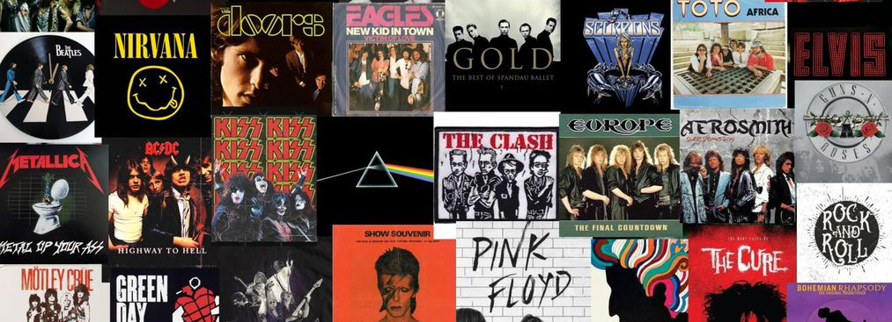

# 📀Recordmendation📀 - DataEngineering 

Recordmendation es una aplicación de IA generativa que permite a los usuarios descubrir nuevas canciones basadas en sus preferencias musicales. El nombre combina "record" (disco musical) y "recommendation" (recomendación), reflejando su funcionalidad principal: recomendar música a los usuarios.

## Descripción del Proyecto
Este proyecto utiliza un modelo de lenguaje avanzado (OpenAI) para generar recomendaciones musicales personalizadas. Los usuarios interactúan con la aplicación proporcionando el nombre de una canción y su intérprete, y a cambio reciben una lista de 5 canciones recomendadas que podrían gustarles, basadas en el input inicial. Los datos ingresados se guardarán en una base de datos en **AWS**, con las columnas "canción", "artista" y "response". También se utilizó **Langchain** para el prompt.

## Estructura
    • app_record.py: código para la aplicación, guardando los datos de entrada y la respuesta en AWS

    • BasedeDatos.ipynb: notebook para creación de base de datos en AWS y para poder revisar ingesta de datos

    • dockerfile: archivo docker para correr la app en Docker

    • requirements.txt : requerimientos para uso de la app

    • index.hmtl: archivo de estructura de página web

    • test_app.py: código para probar la app

    • static: carpeta para imágenes utilizadas en el proyecto y en el README

## Instalación a través de Docker
  1. Descarga la imagen desde Docker Hub: 
       docker pull nataliojpg/app_recordmendation (link de dockerhub:  https://hub.docker.com/r/nataliojpg/app_recordmendation)
     
  2. Ejecuta el contenedor:
       docker run -p 8000:8000 nataliojpg/app_recordmendation

## Uso
  1. Accede a la interfaz web en http://localhost:8000 en el navegador.

  2. Ingresa el nombre de una canción y su intérprete en los campos.

  3. Envía el formulario y espera las recomendaciones generadas por el modelo de IA.

## Herramientas
   • Python
   
   • FastApi
   
   • MySQL
   
   • Uvicorn
   
   • OpenAI
   
   • Docker
   
   • HTML

   • Langchain

   # ♫⋆｡♪ ₊˚♬
   
